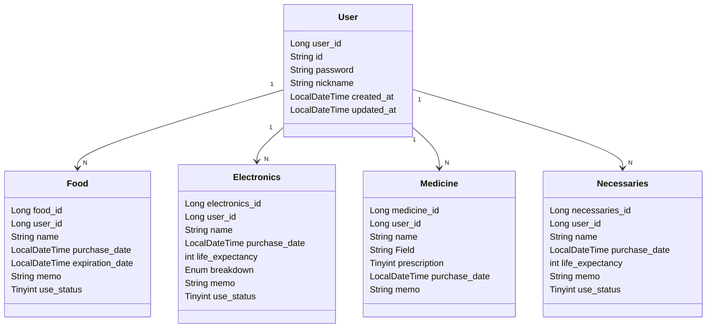

# Whedit (When did I buy it?)

사용자가 구매한 생필품, 전자제품, 약품, 식품에 대해서 언제 구매했는지 기록하고 관리할 수 있도록 돕는 서비스입니다.

## 기능 소개

1. 생필품, 전자제품, 약품, 식품에 대해 등록, 수정, 삭제가 가능
2. 회원제 서비스로 가입후 이용가능함 (회원등록, 탈퇴)

##  기술 스택
- Kotlin
- JDK 21
- Spring Boot 3.3.4
- Spring Data JPA
- Spring Validation
- MySQL
- Gradle

##  ERD

### Database Schema

