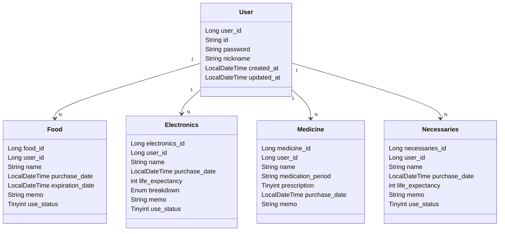

# Whedit (When did I buy it?)

사용자가 구매한 생필품, 전자제품, 약품, 식품에 대해서 언제 구매했는지 기록하고 관리할 수 있도록 돕는 서비스입니다.


## 기능 소개
 
1. 생필품, 전자제품, 약품, 식품에 대해 등록, 수정, 삭제가 가능
2. 회원제 서비스로 가입후 이용가능함 (회원등록, 탈퇴)

##  기술 스택
- Kotlin
- JDK 21
- Spring Boot 3.3.4
- Spring Data JPA
- Spring Validation
- MySQL
- Gradle

##  ERD

### Database Schema




## API 명세서

<details>

<summary>회원 API</summary>

  

#### 1. 회원 가입
- **URL**: `/api/v1/members/signup`
- **Method**: `POST`
- **Request Body**:

```json
{
"id": "string",
"password": "string",
"nickname": "string"
}
```

#### 2. 로그인
- **URL**: `/api/v1/members/login`
- **Method**: `POST`
- **Request Body**:

```json
{
"id": "string",
"password": "string"
}
```


#### 3. 로그아웃
- **URL**: `/api/v1/members/logout`
- **Method**: `POST`
</details>


<details>
<summary>음식목록 API</summary>

#### 1. 음식 정보 추가
- **URL**: `/api/v1/foods`
- **Method**: `POST`
- **Request Body**:
```json
{
"name": "string",
"purchaseDate": "LocalDateTime",
"expirationDate": "LocalDateTime",
"memo": "string",
"useStatus": "tinyint",
}
```

  

#### 2. 음식 정보 수정

- **URL**: `/api/v1/foods/{foodId}`
- **Method**: `PUT`
- **Request Body**:

```json
{
"name": "string",
"purchaseDate": "LocalDateTime",
"expirationDate": "LocalDateTime",
"memo": "string",
"useStatus": "tinyint",
}
```

  

#### 3. 음식 정보 삭제

- **URL**: `/api/v1/foods/{foodId}`
- **Method**: `DELETE`

  
#### 4. 나의 음식 정보 조회

- **URL**: `/api/v1/foods/{userId}`
- **Method**: `GET`
- **Request Body**:

```json
{
"foodId": "Long",
"name": "string",
"purchaseDate": "LocalDateTime",
"expirationDate": "LocalDateTime",
"memo": "string",
"useStatus": "tinyint",
}
```
</details>

<details>
<summary>전자제품 API</summary>

#### 1. 전자제품 정보 추가

- **URL**: `/api/v1/electronics`

- **Method**: `POST`

- **Request Body**:

```json

{
"name": "string",
"purchaseDate": "LocalDateTime",
"lifeExpectancy": "int",
"breakdown": "string",
"memo": "string",
"useStatus": "tinyint",
}
```

#### 2. 전자제품 정보 수정
- **URL**: `/api/v1/electronics/{electronicsId}`
- **Method**: `PUT`
- **Request Body**:
```json
{
"name": "string",
"purchaseDate": "LocalDateTime",
"lifeExpectancy": "int",
"breakdown": "string",
"memo": "string",
"useStatus": "tinyint",
}
```

#### 3. 전자제품 정보 삭제
- **URL**: `/api/v1/electronics/{electronicsId}`
- **Method**: `DELETE`
  
#### 4. 나의 전자제품 정보 조회
- **URL**: `/api/v1/electronics/{userId}`
- **Method**: `GET`
- **Request Body**:

```json
{
"electronicsId": "Long",
"name": "string",
"purchaseDate": "LocalDateTime",
"lifeExpectancy": "int",
"breakdown": "string",
"memo": "string",
"useStatus": "tinyint",
}
```
</details>

<details>

<summary>의약품 API</summary>

#### 1. 의약품 정보 추가

- **URL**: `/api/v1/medicine`
- **Method**: `POST`
- **Request Body**:
```json
{
"name": "string",
"medicationPeriod": "string",
"prescription": "tinyint",
"purchaseDate": "LocalDateTime",
"memo": "string"
}
```

  

#### 2. 의약품 정보 수정

- **URL**: `/api/v1/medicine/{medicineId}`

- **Method**: `PUT`

- **Request Body**:

```json
{
"name": "string",
"purchaseDate": "LocalDateTime",
"lifeExpectancy": "int",
"breakdown": "string",
"memo": "string",
"useStatus": "tinyint",
}
```

  

#### 3. 의약품 정보 삭제

- **URL**: `/api/v1/medicine/{medicineId}`

- **Method**: `DELETE`

#### 4. 나의 의약품 정보 조회

- **URL**: `/api/v1/medicine/{userId}`
- **Method**: `GET`
- **Request Body**:
```json
{
"medicineId": "Long",
"name": "string",
"medicationPeriod": "string",
"prescription": "tinyint",
"purchaseDate": "LocalDateTime",
"memo": "string"
}
```
</details>

<details>

<summary>생필품 API</summary>

#### 1. 생필품 정보 추가

- **URL**: `/api/v1/necessaries`
- **Method**: `POST`
- **Request Body**:

```json
{
"name": "string",
"purchaseDate": "LocalDateTime",
"lifeExpectancy": "int",
"memo": "string",
"useStatus": "tinyint"
}
```

  

#### 2. 생필품 정보 수정
- **URL**: `/api/v1/necessaries/{necessariesId}`
- **Method**: `PUT`
- **Request Body**:

```json
{
"name": "string",
"purchaseDate": "LocalDateTime",
"lifeExpectancy": "int",
"memo": "string",
"useStatus": "tinyint"
}
```

#### 3. 생필품 정보 삭제
- **URL**: `/api/v1/necessaries/{necessariesId}`
- **Method**: `DELETE`

#### 4. 나의 생필품 정보 조회
- **URL**: `/api/v1/necessaries/{userId}`
- **Method**: `GET`
- **Request Body**:

```json
{
"necessariesId": "Long",
"name": "string",
"purchaseDate": "LocalDateTime",
"lifeExpectancy": "int",
"memo": "string",
"useStatus": "tinyint"
}
```
</details>
